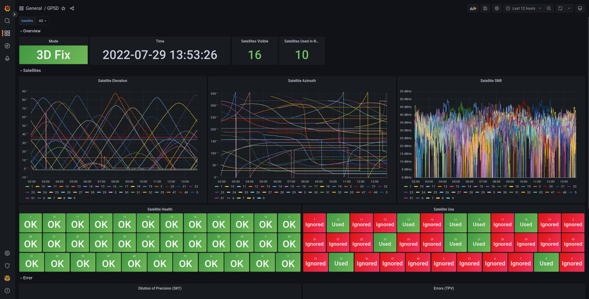

# Prometheus exporter for [gpsd](https://gpsd.io)

[](https://github.com/natesales/gpsd-exporter/releases)
[](https://goreportcard.com/report/github.com/natesales/gpsd-exporter)
[](https://raw.githubusercontent.com/natesales/gpsd-exporter/main/LICENSE)

`gpsd-exporter` polls `gpsd` over its TCP JSON interface and exports the data to Prometheus.

### Supported gpsd classes

- Time position value ([TPV](https://gpsd.io/gpsd_json.html#_tpv))
- Sky view ([SKY](https://gpsd.io/gpsd_json.html#_sky))
- Satellite ([Satellite](https://gpsd.io/gpsd_json.html#_satellite))
- Pseudorange noise report ([GST](https://gpsd.io/gpsd_json.html#_gst))
- Time offset ([TOFF](https://gpsd.io/gpsd_json.html#_toff))
- Pulse per second ([PPS](https://gpsd.io/gpsd_json.html#_pps))
- Oscillator ([OSC](https://gpsd.io/gpsd_json.html#_osc))
- gpsd Version ([VERSION](https://gpsd.io/gpsd_json.html#_version))

See [gpsd's protocol responses](https://gpsd.io/gpsd_json.html#_core_protocol_responses) for more information.


### Grafana



A simple dashboard is available to [import into Grafana](https://grafana.com/docs/grafana/latest/dashboards/export-import/#import-dashboard) from the gpsd-exporter [Grafana JSON file](https://raw.githubusercontent.com/natesales/gpsd-exporter/main/grafana-dashboard.json).

### Quickstart

With `gpsd` running on `localhost:2947`:

#### Linux

Install `gpsd-exporter` from the [apt/yum repo](https://github.com/natesales/repo) or build with `go build`

```bash
$ gpsd-exporter
INFO[0000] Starting metrics exporter on :9978/metrics
INFO[0000] Connecting to gpsd on localhost:2947
```

#### Docker

```bash
docker run -p 9978:9978 ghcr.io/natesales/gpsd-exporter
``` 

### Usage

```bash
Usage of ./gpsd-exporter:
  -d string
        gpsd address (default "localhost:2947")
  -l string
        metrics listen address (default ":9978")
  -p duration
        gpsd poll interval (default 10s)
  -v    enable verbose logging
  -vv
        enable extra verbose logging
```
